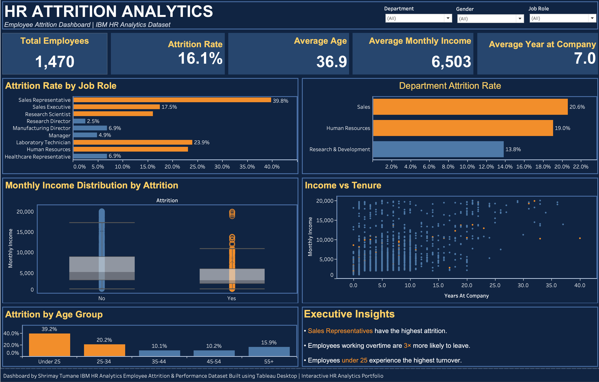

# 📊 HR Attrition Analytics Dashboard

<div align="center">



[](https://public.tableau.com/app/profile/shrimay.tumane/viz/HRAttritionAnalyticsDashboardbyShrimayTumane/HRAnalyticsDashboard)
[](https://www.kaggle.com/datasets/pavansubhasht/ibm-hr-analytics-attrition-dataset)
[]()

### 🔗 [View Live Interactive Dashboard →](https://public.tableau.com/app/profile/shrimay.tumane/viz/HRAttritionAnalyticsDashboardbyShrimayTumane/HRAnalyticsDashboard)

</div>

---

## 📌 Project Overview

An end-to-end interactive HR analytics dashboard built in Tableau, analyzing employee attrition patterns across **1,470 employees** using the IBM HR Analytics Dataset. Designed to help HR teams and business leaders identify the root causes of employee turnover and make data-driven retention decisions.

> **Business Question:** *What drives employees to leave, and which segments are most at risk?*

---

## 🔍 Key Insights

| # | Finding | Impact |
|---|---------|--------|
| 1 | **Sales Representatives** have the highest attrition rate | **39.8%** — nearly 2.5× the company average |
| 2 | Employees working **overtime** are far more likely to leave | **30.5%** vs **10.4%** (non-overtime) |
| 3 | **Under-25 employees** experience the highest turnover | **39.2%** attrition rate |
| 4 | **Sales department** leads departmental attrition | **20.6%** vs 13.8% in R&D |
| 5 | **Lower-income employees** cluster heavily in attrition group | Visible in income distribution analysis |
| 6 | **Human Resources** department shows high attrition | **19.0%** — second highest |

---

## 📈 Dashboard Features

### KPI Strip
- Total Employees · Attrition Rate · Average Age · Average Monthly Income · Average Tenure
- All KPIs respond dynamically to filter selections

### Charts
| Visualization | Type | Key Insight Shown |
|---|---|---|
| Attrition by Job Role | Horizontal Bar | Sales Rep drives highest role-level risk |
| Department Attrition Rate | Horizontal Bar | Sales dept leads at 20.6% |
| Monthly Income Distribution | Box-and-Whisker Plot | Leavers concentrated at lower income bands |
| Income vs Tenure | Scatter Plot | Relationship between pay, tenure, and attrition |
| Attrition by Age Group | Column Chart | Under-25 cohort at highest risk |
| Executive Insights | Annotated Text Panel | Auto-contextualized key findings |

### Interactivity
- ✅ **Department** dropdown filter
- ✅ **Gender** dropdown filter
- ✅ **Job Role** dropdown filter
- ✅ **Reset Filters** button — resets entire dashboard in one click
- ✅ **Dashboard filter actions** — click any mark to cross-filter all charts

---

## 🎨 Design Decisions

| Decision | Rationale |
|---|---|
| Dark navy theme (`#0D1B2A`) | Professional BI aesthetic; reduces eye strain |
| Orange (`#F28E2B`) = above-average attrition | Color encodes risk, not decoration |
| Blue (`#4E79A7`) = below-average attrition | Consistent two-tone meaning throughout |
| Box-and-whisker plot for income | Shows distribution, not just averages — more analytically honest |
| Sorted bars (descending) | Highest-risk roles visible immediately without reading all labels |
| No gridlines or chart borders | Reduces visual noise; follows Tableau best practices |

---

## 🛠️ Technical Implementation

```
Calculated Fields
├── Attrition Flag         → IF [Attrition]="Yes" THEN 1 ELSE 0 END
├── Attrition Rate         → SUM([Attrition Flag]) / COUNTD([EmployeeNumber])
├── Above Avg Attrition    → Attrition Rate > WINDOW_AVG(Attrition Rate)
└── Age Group              → Custom IF/ELSEIF bucketing into 5 cohorts

Table Calculations
└── WINDOW_AVG() used for above/below average color encoding across all bar charts

Chart Types Used
├── Horizontal bar charts (with conditional color logic)
├── Box-and-whisker plot (income distribution)
├── Scatter plot (income vs tenure relationship)
└── Column chart (age group breakdown)
```

---

## 📂 Dataset

| Property | Detail |
|---|---|
| Source | IBM HR Analytics Employee Attrition & Performance |
| Records | 1,470 employees |
| Features | 35 columns |
| Key Fields | Age, Department, Job Role, Monthly Income, Attrition, OverTime, Years at Company, Job Satisfaction, Marital Status |
| Attrition Rate | 16.12% (237 of 1,470 employees) |

---

## 🗂️ Repository Structure

```
HR-Attrition-Analytics-Tableau/
├── README.md                          ← Project documentation
├── dashboard.png                      ← Dashboard preview image
└── data/
    └── WA_Fn-UseC_-HR-Employee-Attrition.csv   ← Source dataset
```

---

## 🚀 How to View

**Option 1 — Live Interactive Version (Recommended)**
Click the Tableau Public link at the top of this README. No installation needed.

**Option 2 — Local Tableau File**
1. Download [Tableau Public](https://public.tableau.com/en-us/s/download) (free)
2. Clone this repository
3. Open the `.twbx` file in Tableau Desktop or Public

---

## 👤 Author

**Shrimay Tumane**
B.Tech Information Technology | Manipal University Jaipur

[](https://public.tableau.com/app/profile/shrimay.tumane)
[](https://linkedin.com/in/shrimaytumane)

---

*Built using Tableau Desktop | IBM HR Analytics Employee Attrition & Performance Dataset*
